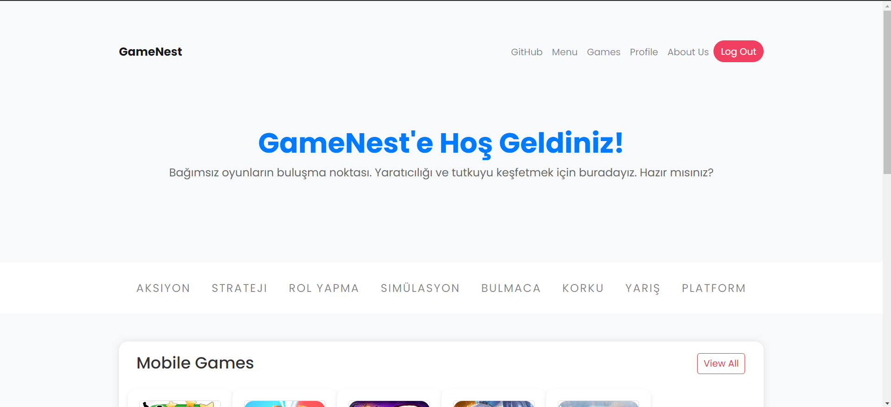
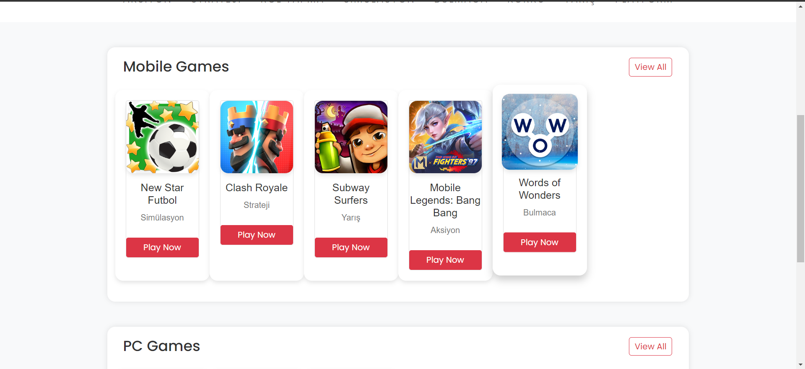
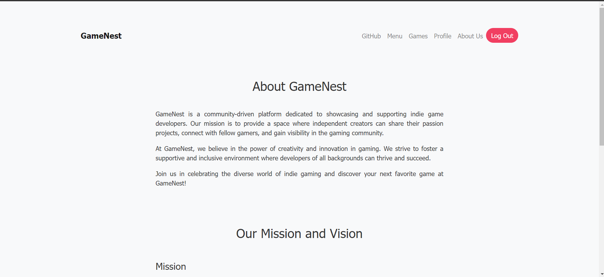
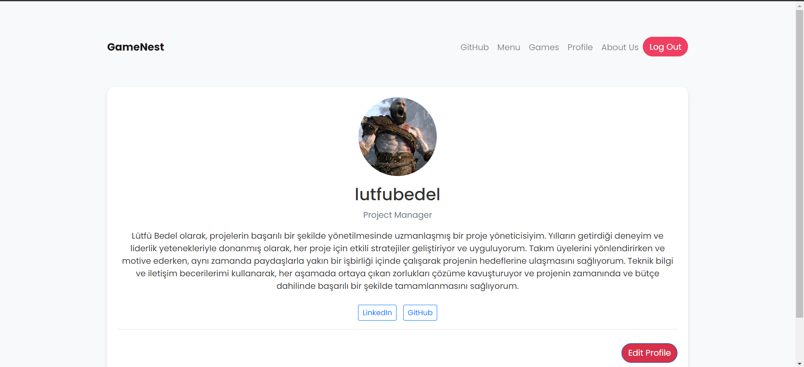
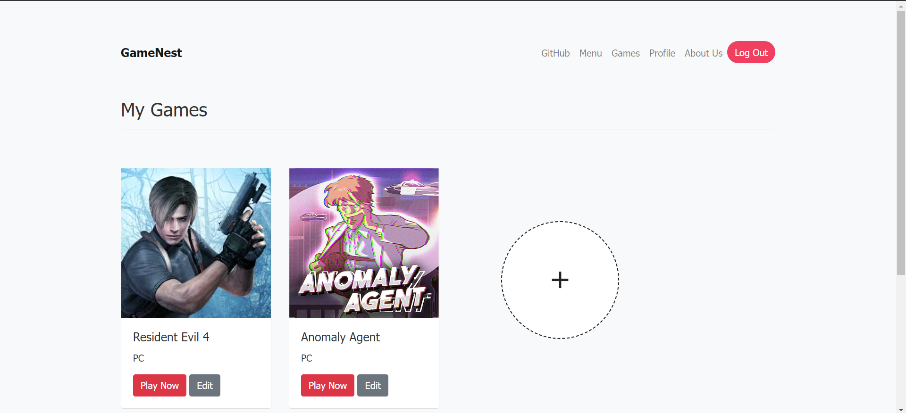
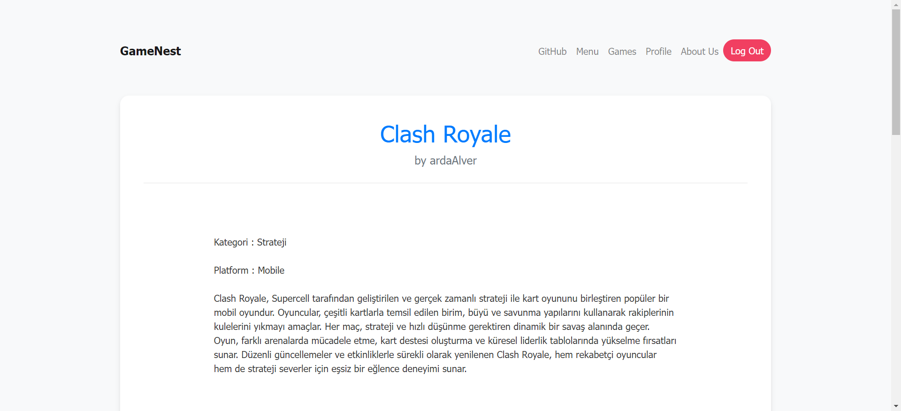

# PHP_GameNest

GameNest, indie oyun geliştiricilerinin oyunlarını paylaşabilecekleri ve diğer geliştiricilerin oyunlarını deneyimleyebilecekleri bir platformdur.

## Özellikler

- Kullanıcılar oyunlarını yükleyebilir, düzenleyebilir ve silebilirler.
- Diğer kullanıcıların yüklediği oyunları görebilir ve deneyimleyebilirler.
- Kullanıcılar profil oluşturabilir ve profillerini düzenleyebilirler.
- Oyunlar kategorilere ayrılmıştır, böylece kullanıcılar istedikleri kategorideki oyunlara kolayca erişebilirler.

## Ekran Görüntüleri

### Ana Sayfa

### Oyun Detayları

## Demo Videosu

[

## Lisans

Bu proje MIT Lisansı altında lisanslanmıştır. Daha fazla bilgi için [LICENSE](LICENSE) dosyasını okuyun.

 
